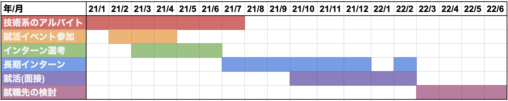

# 就活が終わりました
## はじめに
こんにちは。[task4233](https://task4233.dev)です。

この度、熟慮の末にWeb系のエンジニアとして就職先を決めました。その過程で本当に多くの方々にお世話になりました。この場をお借りして感謝します。本当にありがとうございました！

そして、キリが良いので今までやってきたことを振り返るために本記事を書くことにしました。**本記事の目的は、今年度以降Web系エンジニアを志望する学生に就活の一例を提示すること** です。想定対象者を考えずにダラダラと書いたポエムは別記事に分けたので、そちらを読みたい方は後日公開される就活ポエムをご覧ください。

本記事では、最初に私の素性を簡単に述べた上で私の就活方針を述べ、その後どのようにしてインターンや就活に取り組んできたかを述べます。好きなものだけ掻い摘んで読んでください。スマホ版は左上の≡を押せばメニューが出てきます。

また、良いと感じた会社さんの名前は載せますが、そうでないと感じた会社さんの名前は伏せます。問題がありそうな場合は、お手数ですが[TwitterのDM](https://twitter.com/messages/compose?recipient_id=888012199595171840)にてご連絡いただければ修正しますので、連絡をお願いします:bow:

## 私の素性
私は芝浦工業大学の大学院2年生で、普段はマルウェア検知システムに関する研究をしています。

コンピュータサイエンスを学び始めたのは情報工学科に所属した学部1年次からです。入学時は本格的にプログラミングをすると思っていましたが、離散数学やコンピュータアーキテクチャなどに関する講義が主流だったので拍子抜けしたのをよく覚えています。

そのため、学部の講義だけではプログラミングができるようにならないと感じ、競技プログラミングやCTFを始めました。競技プログラミングは[AtCoder水](https://atcoder.jp/users/task4233)まで行き、CTFは参加だけでなく[ctf4b](https://github.com/SECCON/Beginners_CTF_2022)や[誕生日CTF](https://github.com/task4233/taskctf21-public)で作問サイドにも回りました。

さらにもう少し手を伸ばして、[セキュリティ・キャンプ](https://task4233.hatenablog.com/entry/2019/08/24/132522)や[SecHack365](https://task4233.hatenablog.com/entry/2021/03/31/234326)、複数の長期インターンに参加してきました。詳しくは[ポートフォリオ](https://task4233.dev)を参照してください。

現在の興味分野はバックエンドとWebセキュリティです。最近はとある社で脆弱性スキャナの開発に携わっています。

次は、こんな感じの人がどのような就活方針を立てたのかを書きます。

## 私の就活方針
私の就活方針は、**インターンで経験を積み、そこで得た経験や知見をアピールポイントとして信頼できるエンジニアが多い会社に入る** という方針でした。アピールポイントを研究ではなくインターンの経験にしようと決めたのは、学部4年次の決断が大きく関係しています。

学部4年次の私には、外の大学院を受験して専門性の高い環境で研究をするか、現在の研究室で研究をしながらインターンをするという選択肢がありました。大学院生は研究をすることがメインのはずなので、最初は前者を選択してマルウェア検知系の研究をしている某大学院を受験しました。

学部時代は曲がりなりにもCSをきちんと学んでいた自負があったので、入学試験に受かる前提で入学前から某研究室のミーティングに参加させていただいていました。しかし、当時はコロナが流行り始めていた頃で、殆どのミーティングがカメラオフでの一方的な進捗報告になっていました。

正直、雰囲気はあまり良くなかったです。そのため、このミーティングに何度か参加した後、**環境を変えることに意味があるのかという疑念が日に日に強くなっていきました。**

その後、環境を変えて得るものと失うものを天秤にかけて環境を変えるほどのメリットがないと判断しました。そして、[私の受験料はお布施になりました](https://twitter.com/task4233/status/1366185577196838915)。

背に腹はかえられないので、この決断をした後は研究よりもインターン等を優先することが増えました。大学院生として研究よりも他のことを優先してしまったのは大っぴらに言えることではないですが、私にも人生があるのでこの決断は仕方なかったと思っています。

とはいえ、私は学部時代にインターン全落ちした過去があるため、同じ過ちを繰り返さないように次の手を打つ必要がありました。

## インターンに参加できるのかという不安とその払拭
インターンの選考は本選考よりもハードルが高いと言われることが多いと思います。これは、将来を見据えた技術力ではなく現時点の技術力を求められることが多いためです。

当時の私はセキュリティ・キャンプやSecHack365、技術系アルバイトの参加など様々なことに手を出してはいたものの、周りの学生エンジニアからすれば当たり前、といった風潮を感じ取っていたため、不安だけが募っていきました。

**その根源にあったのは特異性の無さでした。** 言い換えれば、「taskさんは〜をやっている人」と一言で言える材料がなかったということです。今でもそんなものは特にないですが、当時の私はこれを強く危惧していました。

そこで目に入ってきたのが、[Goの仕様書](https://go.dev/ref/spec)を輪読する [Go Specification 輪読会](https://gospecreading.connpass.com/)でした。元々シンプルな設計やioパッケージの良さなどが好みでGoに興味はありましたし、仕様書をしっかり読むという経験をしている学生は少ないと考え、この輪読会に参加することにしました。

その後、ただ学ぶ機会を提供していただいただけでなく、運営サイドに関わったり発表したりすることもできました。この輪読会を始めてくださった[syumaiさん](https://twitter.com/__syumai)には頭が上がりません。この輪読会によって、私はGoに多少なりとも詳しくなれましたし、他の学生が持っていない強みを手に入れたという謎の自信がつきました。

その結果、インターンや本選考の面接では割と自信を持って発言できましたし、自分のペースに持っていくことができたと思います。

ここから先は、そのインターンや本選考の流れについて書いていこうと思います。

## 就活の概観
私が本格的に本選考を受け始めたのは昨年の10月ごろだったと思います。私はありがたいことに複数の長期インターンに参加できたため、7月から12月まではずっと長期インターンをしていました。

[概ね計画していた戦略](#私の就活方針)の通りに動けたと思います。ここから先は、時系列順にやっていたことを少し詳しく書いていこうと思います。

## 学部時代 - インターン全落ち
学部時代は、学科と教職課程の講義および塾講師のアルバイトで月曜日〜土曜日は殆ど時間がなく、日曜日くらいしか余裕を取れる日がありませんでした。

そのため、ロクに趣味開発すらできず、隙間時間で学ぶことができる基本情報や応用情報、ネットワークスペシャリスト、データベーススペシャリスト等の資格試験を受けていました。そして、[prdさん](https://twitter.com/prd_xxx)が以前開催していた、早朝に競技プログラミングの問題を解くゴリラジオ体操や日曜開催のAtCoderのコンテストに参加していました。また、Ruby on Railsのチュートリアルに従いながら、[オリジナルのToDoアプリ(笑)](https://github.com/task4233/terminator)も開発していました。

これらは就活対策などではなく、私が大学に推薦で入ったため引け目を感じていて少しでも情報工学科らしいことをしたかったためです。やっていたこと自体は良かったと思いますが、どれも時間をかければ出来ることなので、決め手にかけるものばかりでした。

その結果、見出しにも書いた通りインターンに全落ちしました。今思うと、その理由は **自分の興味分野だけを触っていたせいで開発現場に目を向けていなかったため** だと思います。

資格を保持していることは選考において魅力的でしょうか？資格取得のために学んだことがマイナスに働くことはないと思いますが、資格取得が優位に働くのは人事面接までだと思います。

AtCoder水色程度の学生は選考において魅力的でしょうか？局所的な問題をデータ構造とアルゴリズムを駆使して解く能力があるという意味では魅力的かもしれませんが、現実でのアプリケーション開発では指示された課題を解決するだけの人に留まってしまう気がします。

ToDoアプリの開発経験のある学生は選考において魅力的でしょうか？大抵の面接官は、そのようなアプリケーションを見飽きていると思います。それは成果物と捉えられるどころか逆効果になることさえありそうです。

それよりかは、もっとアクティブな学生、例えば、**技術的に凄くなくても、本人が自信を持って設計して開発し、その過程で直面した問題を試行錯誤して解決した経験がある学生の方が魅力的に見える** と思います。なぜなら、資格試験や競技プログラミング、チュートリアル等にかける努力は答えがある問題を解決するための努力に過ぎないためです。

SIerやSE等ではないエンジニアは新しい課題に取り組むことが多いと思います。そのため、**自分で設定した問題を自分なりに解決できる能力の方がやり方が確立されたレールの上を走るだけの能力よりも魅力的** だということです。

もちろん、これらの学習が無駄だと言っている訳ではないです。ただ、インターンの選考という観点では見劣りするということです。その点で、自分なりに考えて開発したものが技術的にチープだと感じても、その行為自体は資格を取得したりToDoアプリを作ったりするよりも魅力的だと今は思っています。

## 4月以前 - 技術系アルバイトと逆求人イベント
インターンに全落ちした私は技術系アルバイトを[Wantedly](https://www.wantedly.com/projects?page=1&occupation_types%5B%5D=jp__engineering&hiring_types%5B%5D=internship)で探して、マイナビさんで9ヶ月ほど働かせていただきました。ここでは技術検証と業務改善系の開発をしていました。ありがたいことに与えられたリソースを使って自由に課題を解決して良いタイプのアルバイトだったため、先述した **自分で設計して開発し、その過程で直面した問題を試行錯誤して解決した経験を積めた** のは本当に運が良かったと思っています。

このアルバイトの後に、サポーターズさんとジースタイラスさんの逆求人イベントに計3回参加しました。逆求人イベントとは、会社側が気になった学生をスカウトして1人あたり10〜15分程度の面談を行ってくれるイベントのことです。このイベントに参加する学生は、エンジニアさんと直接話したりインターンの参加権を得たりすることができます。

このイベントでは、各社のエンジニアさんが私の書いたコードに対してコメントしてくださったり、設計やアーキテクチャについて議論してくださったりしたので、逆求人イベントの体験は全体を通して非常に良かったです。 **ここでクリティカルなコメントをくださったエンジニアの所属する会社さんは非常に魅力的に感じました** (ちょろい)。

## 4月から7月 - 虚無
大学院の講義と研究を黙々とやっていました。大学院の講義は学部時代よりも技術的なディスカッションが多くて面白かったです。一方で、課題実装がかなり重いにも関わらず締め切りが講義の翌日という ~~クソ~~ 面白い講義があったので毎週徹夜していた気がします。

## 8月から12月 - インターン
6社の会社さんでインターンをさせていただきました。

### アカツキさん
3週間、APIの設計と実装とパフォーマンス改善に携わらせていただきました。

その時の記事は[こちら](https://task4233.hatenablog.com/entry/2021/08/28/012421)です。

人事とATLASチームの皆さん、そしてメンターの[なかひこさん](https://twitter.com/takanakahiko)のおかげで非常に良い体験ができました。初めてのサマーインターンがアカツキさんで本当に良かったです。

### CARTAさん
3週間、Treasureに参加させていただきました。

その時の記事は[こちら](https://task4233.hatenablog.com/entry/2021/08/30/020506)です。

このインターンはいわゆるスクール型で、実践的な業務ではなく学生への学びを主眼に置いたインターンでした。その過程で、技術力のみならずアイデアの発想法なども一緒に学べたのが印象的でした。また、学生エンジニア仲間ができたのも良かったです。

### Yahoo!さん
2週間、広告配信システムの機能追加フローを一通り体験させていただきました。

その時の記事は[こちら](https://task4233.hatenablog.com/entry/2021/09/27/210359)です。

インターンでは、事前にやることが決められていましたし、ある程度融通の利く働き方ができたので良かったです。やることが事前に用意されており、サポート体制が万全だったので、私の普段のパフォーマンス以上の成果が出せました。

### Wantedlyさん
3週間、検索システムのモデルとサービスの境界面に関わる業務に携わらせていただきました。

このインターンでは私の能力不足であまりパフォーマンスを出せず、メンターの方々やチームの皆さんに迷惑をかけてしまいました。この経験を振り返ることで、私がどのような時にパフォーマンスが出なくなるのかを知るきっかけになったので良かったです。

### DeNAさん
2ヶ月間、[カラダモ](https://caradamo.jp/)のAPI開発と業務改善に携わらせていただきました。

週2日勤務にも関わらず、メンターの[jiroshinさん](https://twitter.com/s_jiroshin)のおかげで色々と学びがありましたし、社内のイベントに参加させていただけたのもよかったです。

また、人事の方々が真剣に将来について議論してくださり、非常に印象が良かったです。

### Mercariさん
3ヶ月間、内部のインターンに従事させていただきました。

一言で言うと、非常にカオスなインターンでした。負荷が高く色々と苦労しましたが、その分圧倒的に成長できたと思います。また、物理出社してランチ等にも行けて雰囲気が知れたのも良かったです。

## 10月から3月 : 本選考
この時期は面接を受け始めていました。インターンに従事させていただいた会社さんがほとんどだったので、あまり面接自体の記憶は強く残っていません。インターンに参加していた会社さんは基本的に人事面接はなく、エンジニアさんとの面接からのスタートだったと思います。

面接の過程で逆質問のときに相手の人間性を知れるのですが、得意な技術の特性を理解せずに使っているエンジニア、学習する気がないテックリード、フレームワークを知らないPdMなどがいることを知り、その人が所属する会社に対する志望度がガクンと下がったことも何度かありました。

ここら辺の話が聞きたい人はご飯に誘ってくれれば話します。

また、この時期にRECRUITさんのホットペーパービューティーで[BFFレイヤの高速化](https://blog.recruit.co.jp/rls/2022-03-22-bff-perf-optim/)にも取り組ませていただきました。Javaには久々に触れたのですが、社員さんの丁寧な働き方と高い言語化能力のおかげでなんとか成果が出せたのは良かったと思います。

## 4月から7月 : 決め
正直、最後まで悩みました。

ありがたいことに承諾期限を設けないでくださった会社さんがほとんどだったので、最後まで悩めたのはよかったです。

というのも、私の選定基準は以下の通りでした。

- 必須要件
  - 技術的な強みを持っている人に囲まれて業務ができる
  - タスクを進める上で「なぜ」が共有されること
  - タスクに関係ない技術に関しても関心を持っている人がいること
- 歓迎要件
  - アウトプットする文化があるとなお良い
  - Goが使えること
  - 自分の関心ごとに応じて、半期もしくは1年単位でチームの移動が許されていること

しかし、 **インターンをしてみると、ある程度の会社さんはこれらの条件を満たしている** という現実に気づきました。そのため、どの会社さんにするかを決めあぐねていました。

紆余曲折あり、最後に決め手になったのは **今までの人生を振り返ったときに自分がどんなときにもっとも成長したか** でした。

振り返ってみると、私は厳しい環境ほどやる気を出す人間であり、緩い環境ほどサボる人間でした。したがって、自らを厳しい環境に身を置くことが私のファーストキャリアに必要だと考えました。補足しておきますが、この "厳しい環境" は理不尽な厳しさではなく、技術的に難しい課題に取り組める環境ということです。

最初のうちに手を出せる範囲は狭いかもしれませんが、業務の中で少しずつ自分の強みを元にその範囲を広げていければ良いと思います。

## おわりに
ここまでお読みいただきありがとうございました。
長々と書いてきましたが、私が就職先を決め切るまでの過程はこんな感じでした。
私のような凡人でも納得できる就活ができたのは、単に運が良かったとしか言いようがありません。

そのため、このポエムが参考になるか、と言われるとあまり参考にならなかったかと思います。読み物として楽しんでもらえたなら幸いです。

最後になりますが、就活関連で相談に乗ってくださったエンジニアの皆さん、人事の皆さん、エンジニアの友人、高校時代の同期、そして家族へ。直接的なサポートを受けていなくとも、社の利害に関係なく動いてくださった皆さんには本当に感謝しています。ありがとうございました。

私がどのように彼らに貢献できるかは分かりませんが、社会人になってからは可能な限り自らの知見を言葉にしてアウトプットしようと考えています。ここから先もこのような幸運がどこまで続くかは分かりませんが、出来ることを精一杯やっていこうと思います。

拙い文章でしたが、ここまでお読みいただきありがとうございました。いずれまた、どこかで。
